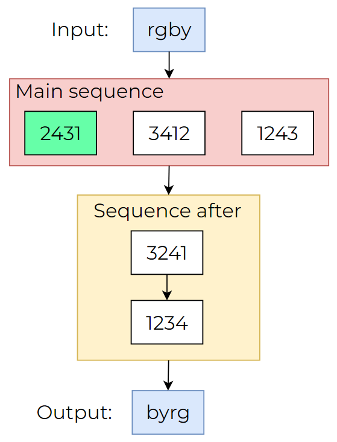

# ColorCode finder

A small project to identify the right code from the sequence written in Go.

## Concept

I once was in a online assessment in which I was given the task to find a code that changes colors' position.

- Example #1 - one sequence:

In here, `rgby` is being converted into `byrg` with the code `3412`. So `r` goes into the first position, `g` - the second, `b` - the third and `y` - the last. You get the jist, it is no more than indexing the inputs and the values.

- Example #2 - main sequence with codes before it:

The same algorithm applies, it is just hindered by additional numbers before thus making the actual requested code difficult to find.

- Example #3 - main sequence with codes after it:

Same thing, just go apply the information above backwards.

- Example #4 - main sequence surrounded by additional ones:

The juice of the assessment - combined task with every case in one.

**There can be any length to the sequence, not only three or two entries**

## Usage

Use the CLI with `go run main.go` (supports two boolean flags: `input` and `output`. Set them to *true* if you want to use any additional sequences).

After that, you will be prompted to provide your sequences in multiple prompts. 

Then, by prompting `s` to the input field, you'll get your answer.

## TO-DO

Unit tests 🥲